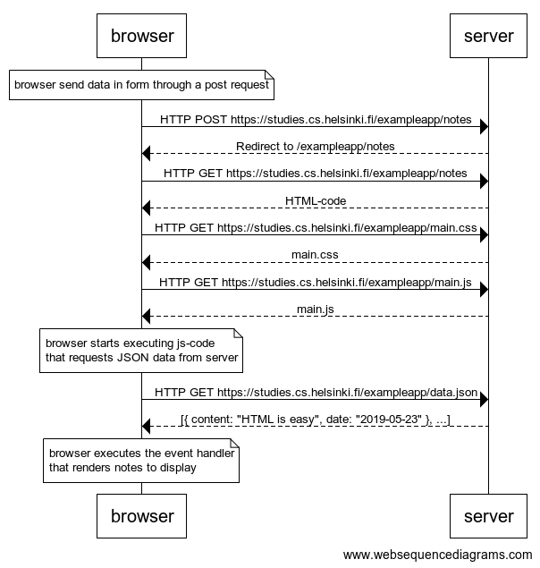
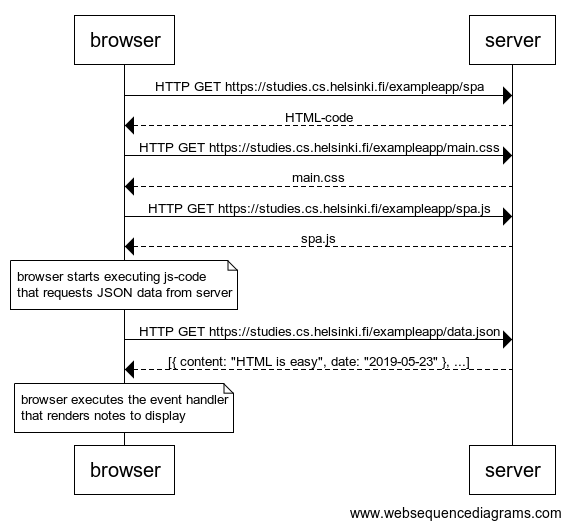
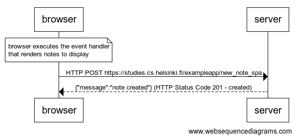

# Part 0 - Fundamentals of Web Apps

## 04 - new note:

Create a similar diagram representing the situation where the user creates a new note on the page https://studies.cs.helsinki.fi/exampleapp/notes by typing something in the text field and clicking the submit button.

If necessary, show the operations in the browser or on the server as comments in the diagram.

## 05 - Single page app:

Create a diagram depicting the situation where the user goes to the single page app version of the notes app at https://studies.cs.helsinki.fi/exampleapp/spa.

## 06 - New note
Create a diagram depicting the situation where the user creates a new note using the single page version of the app.

